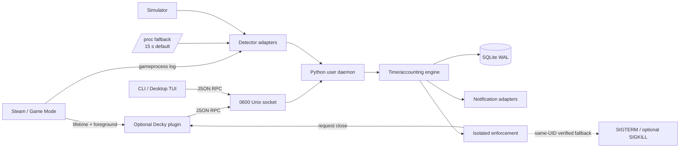
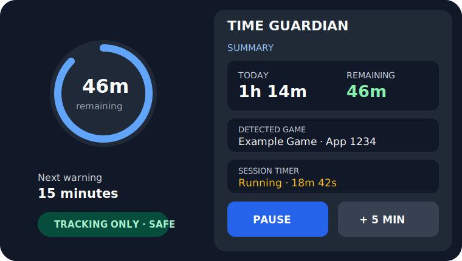
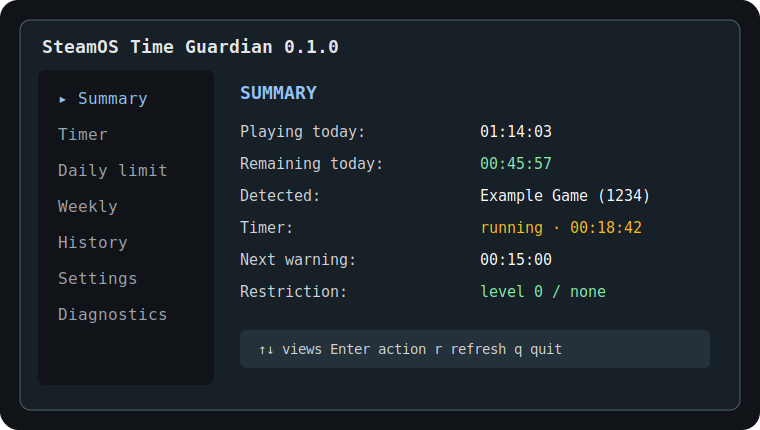

# SteamOS Time Guardian

`steamos-time-guardian` is a local, privacy-preserving play-time tracker and configurable session guardian designed for SteamOS and Steam Deck. It provides session timers, per-day limits, progressive warnings, usage history, conservative game-closing actions, a Desktop Mode CLI/TUI, and an optional Decky Loader Quick Access Menu frontend.

> **Alpha / hardware-validation pending.** The core, installer, simulator, tests, and Decky build are validated on a conventional Linux development environment. This repository does **not** claim validation on a physical Steam Deck yet. Follow [the hardware validation plan](docs/steam-deck-validation-plan.md) before enabling enforcement.

## What is implemented

- Manual session timer: start, pause, resume, cancel, add/remove time, and per-timer action override.
- Daily play allowance with weekly rules, unlimited days, configurable reset time/time zone, exceptional adjustments, and optional allowed periods.
- Event-driven game detection adapters: Decky foreground/lifetime signals, Steam `gameprocess_log.txt`, and a low-frequency `/proc` fallback.
- Suspend-aware monotonic time accounting; only detected gameplay counts by default.
- Non-repeating warnings at 30, 15, 5, and 1 minute plus exhaustion.
- Native Desktop notifications and Game Mode Decky toasts.
- Restriction levels 0–3 with fail-safe defaults and an isolated enforcement subsystem.
- SQLite/WAL history, daily and weekly summaries, retention, clear, JSON export, and CSV export.
- XDG paths, a `systemd --user` unit, structured JSONL logs, diagnostics, and a redacted support bundle.
- A full simulator for development without Steam Deck hardware.
- Offline-friendly Python runtime: the daemon has no third-party runtime dependency.

## Architecture at a glance



The daemon is the source of truth and works without Decky. Decky is deliberately optional because it is third-party software and may require repair after SteamOS/Steam Client updates. See [architecture](docs/architecture.md), [architecture comparison](docs/architecture-comparison.md), and the [ADRs](docs/decisions/).

## Interface mockups

| Quick Access Menu | Desktop Mode TUI |
|---|---|
|  |  |

The SVGs are design mockups, not screenshots from a physical Steam Deck.

## Requirements

### Runtime

- SteamOS stable or a compatible Linux system with Python 3.11+.
- A per-user `systemd` manager is recommended on SteamOS.
- `notify-send` is optional for Desktop Mode notifications.
- Decky Loader is optional and is required only for Quick Access Menu integration and Steam-native close requests.

### Development

- Python 3.11+.
- Node.js 22 and TypeScript 5.8.3 to rebuild the Decky frontend.
- Pinned developer tools from `pyproject.toml`.

## Install for the current user

Build first, inspect the dry run, and install without Decky:

```bash
./scripts/build.sh
./scripts/install-user.sh --dry-run
./scripts/install-user.sh
```

Installation remains below the current user's home and XDG directories. It never calls `sudo`, `pacman`, or `steamos-readonly` and does not modify SteamOS's immutable root.

To include the already-built Decky plugin when Decky Loader is present:

```bash
./scripts/install-user.sh --with-decky
```

The script does not install Decky Loader and does not restart Steam. Reload plugins or restart the Steam client through its UI. Detailed paths, upgrades, rollback behavior, and recovery are in [installation.md](docs/installation.md).

## Basic use

```bash
steamos-time-guardian status
steamos-time-guardian tui
steamos-time-guardian timer start 45m
steamos-time-guardian timer pause
steamos-time-guardian timer add 10m
steamos-time-guardian timer resume
steamos-time-guardian timer cancel
steamos-time-guardian bonus 30m --reason "Weekend exception"
steamos-time-guardian history list --limit 20
steamos-time-guardian history export --format csv --output sessions.csv
steamos-time-guardian summary weekly
steamos-time-guardian diagnose
```

Configuration can be updated atomically with a partial JSON object:

```bash
steamos-time-guardian config patch '{"restriction":{"level":1}}'
```

The default restriction level is **0 (tracking and warnings only)**. Do not enable levels 2 or 3 on a real Steam Deck until controlled-close validation has completed with an expendable test game.

## Restriction levels

| Level | Behavior | MVP implementation |
|---|---|---|
| 0 | Track and notify only | Records exhaustion and continues safely. |
| 1 | Soft restriction | Persistent warning; blocks new/resumed timers while exhausted. |
| 2 | Controlled close | Grace period, asks Decky/Steam to terminate the current app, then optionally sends verified same-user `SIGTERM`. |
| 3 | Temporary cooperative block | Repeats level-2 action for newly detected games until reset/bonus; never blocks Desktop Mode, settings, power, SSH, or recovery tools. |

Forced `SIGKILL` is disabled by default. All local restrictions are bypassable by a technically capable owner or administrator; this is a safety-oriented self-management tool, not tamper-proof parental-control infrastructure.

## Detection model

Detection is confidence-ranked rather than process-name-only:

1. Decky reports the focused app and Steam lifecycle notifications.
2. The daemon tails Steam's process log using inotify when available.
3. `/proc` is scanned no more often than the configured fallback interval and only for same-user processes carrying Steam app environment variables.
4. The simulator replaces all real adapters in test mode.

Steam's internal frontend objects and process-log format are not stable public APIs. They are encapsulated and may need updates after Steam releases. Non-Steam shortcuts can expose App ID `0`; emulators can represent one launcher rather than the emulated title; foreground certainty outside Game Mode is limited. See [architecture.md](docs/architecture.md#game-detection) and [limitations](docs/limitations.md).

## Development without a Steam Deck

```bash
./scripts/bootstrap-dev.sh --online
./scripts/start-dev.sh --reset
```

In another terminal, use the isolated `.dev` XDG paths and emit simulator events:

```bash
XDG_CONFIG_HOME="$PWD/.dev/config" \
XDG_DATA_HOME="$PWD/.dev/data" \
XDG_STATE_HOME="$PWD/.dev/state" \
XDG_RUNTIME_DIR="$PWD/.dev/runtime" \
PYTHONPATH=daemon/src \
python3 -m stg simulate game_started --app-id 570 --name "Simulated Dota 2"
```

Supported events include game start/change/stop, suspend/resume, limit reached, successful close, unresponsive game, and service-restart checkpoint.

## Build, test, and package

```bash
./scripts/format.sh --check
./scripts/lint.sh
./scripts/test.sh --coverage
./scripts/build.sh
./scripts/smoke-test.sh
./scripts/package.sh
```

A single `./scripts/package.sh` creates a deterministic full-project ZIP, a Decky plugin ZIP, and SHA-256 sidecar files under `dist/`.

## Validation status

Automated coverage includes time accounting, daily reset, schedule rules, pause/resume, suspend gaps, clock changes, config/database migration, interrupted-session recovery, Unix IPC, concurrent requests, history, restrictions, notifications, and detector parsing.

The exact conventional-Linux commands, tool versions, results, and validation boundaries for this
release are recorded in the [local validation report](docs/local-validation-report.md).

Not yet validated on physical hardware:

- SteamOS Game Mode lifecycle behavior across all game types.
- Decky rendering/navigation on the current Steam client.
- Native toast behavior while a game is active.
- Real suspend/resume and clock-reset behavior.
- Controlled Steam app termination and same-user process fallback.
- CPU, RAM, wakeup, disk, and battery impact on Steam Deck.
- Persistence through an actual SteamOS update.

## Data and privacy

No account, cloud service, telemetry, analytics endpoint, or network listener exists. Data stays on the device. The API is a mode-`0600` Unix socket and checks Linux peer credentials when available. Configuration, data, and state follow XDG conventions; see [configuration.md](docs/configuration.md) and [security-model.md](docs/security-model.md).

## Troubleshooting

```bash
./scripts/status.sh
./scripts/diagnose.sh
./scripts/diagnose.sh --bundle ./stg-support.zip
journalctl --user -u steamos-time-guardian.service --since today
```

The support bundle omits session history and redacts home-directory paths. More guidance is in [troubleshooting.md](docs/troubleshooting.md).

## Uninstall

Remove program files and keep configuration/history:

```bash
./scripts/uninstall-user.sh --remove-decky
```

Purge all local configuration, history, logs, and runtime files only with explicit confirmation:

```bash
./scripts/uninstall-user.sh --remove-decky --purge-data --yes
```

## Known limitations

- Decky is not a Valve component; compatibility can break with Steam updates.
- The fallback detector cannot reliably distinguish an emulator frontend from its current ROM.
- Non-Steam shortcuts may not expose a useful App ID.
- Level 3 is cooperative, not a kernel/security boundary.
- Desktop notifications may not appear over Game Mode; Decky toasts are the preferred Game Mode channel.
- The daemon deliberately refuses broad process-name killing and may therefore fail closed rather than terminate an ambiguous app.

## Roadmap

1. Validate the complete matrix on a physical Steam Deck over SSH.
2. Harden detector compatibility fixtures from real Steam logs.
3. Refine Game Mode focus transitions and non-Steam metadata.
4. Add an optional PIN policy without pretending it is tamper-proof against the owner.
5. Add localization resources and richer charts after resource measurements.
6. Submit the Decky plugin only after current-loader review and device testing.

## Documentation map

- [Architecture](docs/architecture.md)
- [Architecture comparison](docs/architecture-comparison.md)
- [Installation](docs/installation.md)
- [Configuration and data](docs/configuration.md)
- [IPC API](docs/api.md)
- [Security model](docs/security-model.md)
- [Resource usage](docs/resource-usage.md)
- [Testing](docs/testing.md)
- [Local validation report](docs/local-validation-report.md)
- [Troubleshooting](docs/troubleshooting.md)
- [Known limitations](docs/limitations.md)
- [Steam Deck validation plan](docs/steam-deck-validation-plan.md)
- [Research sources](docs/sources.md)
- [Architecture decisions](docs/decisions/)
- [Instructions for future coding agents](AGENTS.md)
