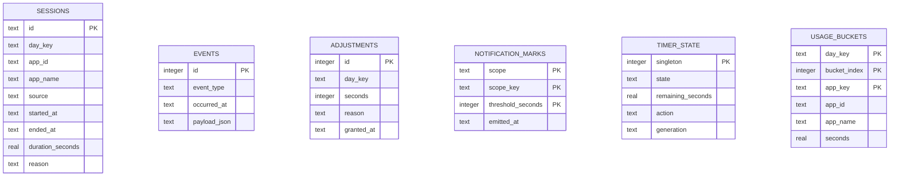
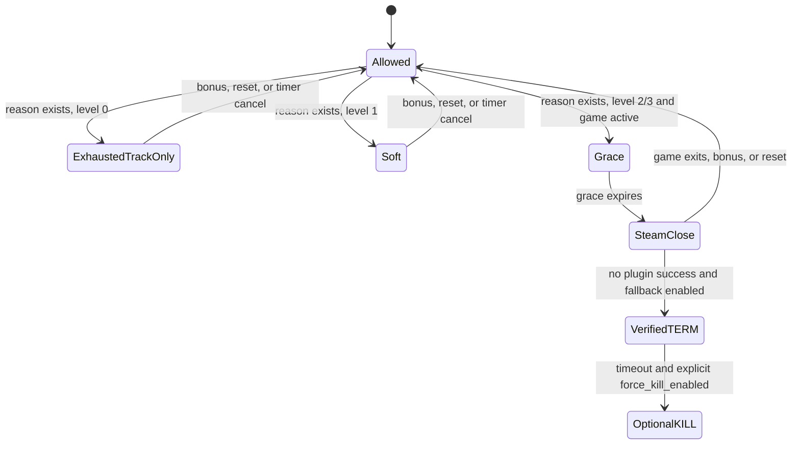

# Architecture

## Goals and constraints

SteamOS Time Guardian must remain useful when Decky is absent, preserve data across ordinary SteamOS updates without changing the immutable root, consume negligible resources while idle, and fail safely if Steam or a detector changes. It is a single-user, local-only application with no cloud component.

The selected design is a **hybrid user-space architecture**: a long-lived Python user daemon owns time/accounting and storage; an optional Decky plugin supplies Game Mode visibility and high-confidence Steam lifecycle signals; a CLI/TUI supplies Desktop Mode access.

## Component view

```mermaid
flowchart TB
  subgraph UI[User interfaces]
    QAM[Decky Quick Access Menu]
    TUI[Desktop curses TUI]
    CLI[CLI and scripts]
  end
  subgraph Service[User daemon]
    RPC[Unix RPC server]
    Orchestrator[Service orchestrator]
    Domain[Domain engine]
    Detection[Composite detector]
    Notifications[Notification fan-out]
    Enforcement[Enforcement manager]
  end
  subgraph Adapters[System adapters]
    DeckySignal[Decky foreground and lifecycle]
    SteamLog[Steam log and inotify]
    Procfs[/proc fallback]
    NotifySend[Freedesktop notify-send]
    SteamClose[SteamClient.Apps.TerminateApp]
    Signals[verified same-UID signals]
  end
  DB[(SQLite WAL)]
  Config[(XDG JSON config)]
  QAM --> RPC
  TUI --> RPC
  CLI --> RPC
  RPC --> Orchestrator
  Orchestrator --> Domain
  Detection --> Orchestrator
  DeckySignal --> Detection
  SteamLog --> Detection
  Procfs --> Detection
  Domain <--> DB
  Orchestrator --> Notifications
  Notifications --> QAM
  Notifications --> NotifySend
  Orchestrator --> Enforcement
  Enforcement --> QAM
  QAM --> SteamClose
  Enforcement --> Signals
  Config --> Orchestrator
```

## Responsibilities

### Domain engine

`daemon/src/stg/engine.py` is independent of systemd, Decky, sockets, notifications, and process signals. It owns:

- active-game session transitions;
- monotonic elapsed-time accounting;
- manual timer transitions;
- accounting-day reset and active-session rotation;
- warning threshold deduplication;
- effective restriction reason/level;
- history event production.

Its injected `Clock` and `Storage` make suspend, wall-clock changes, and restart recovery deterministic in tests.

### Service orchestrator

`service.py` serializes all mutations with one `asyncio.Lock`, consumes detector events, runs the adaptive tick loop, exposes RPC methods, fans out notifications, and invokes enforcement only for explicit domain events. The tick interval is five seconds while an active game/timer requires accounting and 30 seconds while idle.

### Persistence

SQLite opens in WAL mode with foreign keys enabled. Migrations run transactionally and are versioned. A partial unique index prevents two open sessions. The engine checkpoints active duration and timer state at a configurable interval (30 seconds by default), avoiding per-second writes.



On startup, an incomplete session closes with `service_restart_recovery`; the last checkpointed duration is retained rather than inventing elapsed time while the daemon was down. Database diagnostics expose `PRAGMA quick_check` and schema version.

`usage_buckets` is an optional derived local aggregate for the Activity heatmap. It has six
four-hour blocks per accounting day and game identity, not a raw timeline. The engine only queues
blocks while its monotonic and wall-clock intervals agree, then flushes them with the normal
checkpoint/session-close write cadence. Suspend gaps and material clock jumps are omitted instead
of being assigned to an invented hour. Existing session history is never backfilled into this
table, so usage totals remain useful immediately without presenting approximate heatmap data as
fact.

## IPC

The RPC endpoint is newline-delimited JSON over a Unix domain socket:

- path: `$XDG_RUNTIME_DIR/steamos-time-guardian/control.sock`;
- directory mode: `0700`;
- socket mode: `0600`;
- no TCP listener;
- Linux peer credentials checked with `SO_PEERCRED` and rejected when UID differs;
- request and line-size limits;
- strict method-specific validation;
- structured error objects;
- serialized mutations and concurrent client connections.

Decky cannot directly reach the user's socket under every loader execution model, so its rootless Python backend is a narrow local bridge. It neither owns state nor chooses process targets; it forwards RPC and, when requested, calls Steam's frontend termination API.

## Game detection

### Ranked sources

1. **Decky foreground signal (confidence 1.0).** The frontend reads the current running app from Steam UI state and sends heartbeats. It also subscribes to app-lifetime notifications. This gives the best Game Mode view but relies on Decky and undocumented Steam client objects.
2. **Steam process log (confidence 0.85).** The daemon tails `gameprocess_log.txt`, groups PIDs by App ID, observes add/remove/running-list messages, and resolves names from app manifests. Linux inotify avoids regular polling; a long timeout handles missed events/rotation.
3. **Procfs fallback (confidence 0.55).** Every 15 seconds by default, it examines same-UID process environments for `SteamAppId`, `SteamGameId`, or `STEAM_COMPAT_APP_ID`; it groups auxiliary processes by App ID. It never treats a process name alone as proof.
4. **Simulation (confidence 1.0 in simulation mode).** Deterministic explicit events replace hardware adapters.

The composite detector applies source priority and a short Decky signal TTL. Lower-confidence stop events do not override a recent higher-confidence Decky foreground state.

### Start, stop, and change

A source emits `STARTED`, `STOPPED`, or `CHANGED` carrying a `GameIdentity` with App ID, name, source, PIDs, instance ID, and confidence. The engine ensures one open session; changing identity closes the old session with `game_changed` and opens the next one.

### Foreground semantics

In Game Mode, Decky's `MainRunningApp` is the best available foreground signal. Steam lifetime notifications establish running state, not foreground state. Outside Game Mode, Steam log/procfs indicate a Steam-launched game but cannot guarantee window focus. The application therefore reports *detected gameplay*, not universal desktop foreground authority.

### Auxiliary processes

Steam log and procfs sources group multiple PIDs by App ID, so launchers, Proton helpers, crash handlers, and child processes do not become separate games. The session ends only after the source no longer tracks the App ID.

### Emulators and non-Steam shortcuts

Steam may report non-Steam lifetime notifications with App ID `0`. The Decky foreground display name is retained, but reliable per-ROM identity may be unavailable. An emulator shortcut normally becomes one application unless future hardware validation finds metadata suitable for a dedicated emulator adapter.

### False positives and safe degradation

Ignored App IDs/names filter known shell/UI processes. Ambiguous or App-ID-zero procfs findings are ignored. When an adapter fails, the service remains available for manual timers/history and reports detector errors. A lower-confidence detector can still drive normal policy, but the process-signal fallback independently requires an exact, nonzero Steam App ID and same-UID environment match; it never converts a name-only guess into a kill target.

## Time management

The engine compares `time.monotonic()` deltas with UTC wall-time deltas. Gameplay and timers use monotonic elapsed seconds, so ordinary wall-clock/time-zone changes do not create or remove play time. A large wall/monotonic discrepancy is recorded as inferred suspend/resume and excluded. Explicit suspend/resume events also freeze accounting and reset baselines.

The accounting day is defined by configured time zone and reset clock, not merely calendar date. At reset, an active session closes and immediately reopens under the new day key so summaries remain exact.

Effective daily allowance is:

```text
weekly base limit + sum(today's exceptional adjustments)
```

An unlimited day yields no limit. Optional allowed periods are an additional condition; intervals crossing midnight are supported.

## Warning system

For each daily day key and timer generation, SQLite records sent threshold marks. Crossing a threshold emits one notification. Adding time clears marks for that scope so newly relevant warnings can occur again. Exhaustion uses threshold zero and can be persistent.

Channels:

- Decky toaster inside Game Mode when connected;
- Freedesktop notification through `notify-send` in Desktop Mode;
- history event regardless of channel availability.

Failure to notify never changes accounting or enforcement state.

## Restriction and enforcement

Tracking produces an effective reason (`daily_limit`, `timer_expired`, or `outside_allowed_period`) and action level. Enforcement is invoked only for level 2/3 events.



- Level 0 emits `allowance.exhausted` but never blocks or closes.
- Level 1 prevents timer start/resume and produces persistent warnings.
- Level 2 arms a grace period and asks the plugin to call `SteamClient.Apps.TerminateApp`. If unavailable, the safe fallback searches only same-UID PIDs with a matching Steam App ID and sends `SIGTERM`.
- Level 3 applies the same sequence to newly detected games while the reason remains. It does not alter Steam library files or OS access.
- `SIGKILL` requires `force_kill_enabled=true` and remains a last resort.

The owner can stop the service, edit data, or uninstall it; a local self-control tool cannot be impossible for that owner to bypass.

## Recovery behavior

| Failure | Behavior |
|---|---|
| Daemon restart | Active session closes at last checkpoint; timer persists; systemd restarts on failure. |
| Corrupt config | File is quarantined with UTC timestamp; defaults are written; diagnostic records recovery. |
| Corrupt DB | Health check fails and recovery can quarantine/recreate safely; no uncertain enforcement. |
| Clock/time-zone change | Monotonic accounting continues; day key is recalculated; offset change is recorded. |
| Suspend | Explicit or inferred gap is excluded; baselines reset on resume. |
| Decky disconnect | Daemon continues; other detector/notification paths remain. |
| Detector exception | Adapter emits an error and stops; service remains available. |
| Partial install | Rollback restores previous program files; existing config/data are preserved. |
| Concurrent RPC | One service lock serializes mutation; DB constraints prevent duplicate open sessions. |

## Runtime file layout

```text
~/.config/steamos-time-guardian/config.json
~/.local/share/steamos-time-guardian/guardian.db
~/.local/state/steamos-time-guardian/guardian.jsonl
$XDG_RUNTIME_DIR/steamos-time-guardian/control.sock
~/.local/lib/steamos-time-guardian/...
~/.local/bin/steamos-time-guardian
~/.config/systemd/user/steamos-time-guardian.service
~/homebrew/plugins/SteamOS-Time-Guardian/   # optional Decky
```

All persistent locations are below the user home. No claim is made that third-party Decky itself remains operational across every update.
